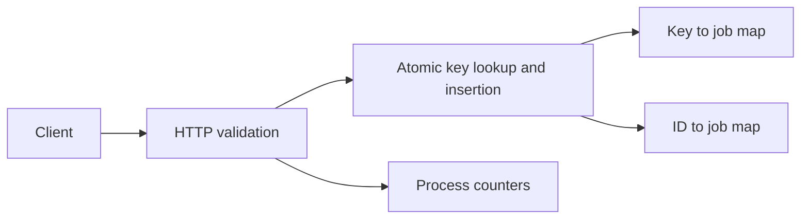

# Job Intake Service

A small Java backend reference project demonstrating idempotent request handling, bounded in-memory state, explicit HTTP errors, and concurrent integration tests. Created as a standalone portfolio exercise in 2026; it contains no employer code or production data.

## Run

Requires a JDK 21 or newer. No Maven, Gradle, or third-party dependencies are required.

```sh
./test.sh
./run.sh 8080
```

The server binds to **127.0.0.1**. In another terminal:

```sh
curl -i -X POST http://127.0.0.1:8080/jobs \
  -H 'Content-Type: text/plain' \
  -H 'Idempotency-Key: daily-report-001' \
  --data 'Generate the daily report'
```

The response is `201 Created` with a generated job ID and `Location: /jobs/<id>`. Repeat the same request to get `200 OK` with the **same ID**. Change the payload while reusing the key to get `409 Conflict`. `GET /jobs/<id>` returns the accepted job's ID and status. Payloads are never echoed in responses.

## API contract

| Endpoint | Behavior |
|---|---|
| `GET /health` | `200` process health |
| `POST /jobs` | `201` new acceptance; `200` replay; `409` conflicting reuse |
| `GET /jobs/<id>` | `200` accepted job; `404` unknown ID |
| `GET /metrics` | Text counters for creation, replay, conflict, and capacity rejection |

`Idempotency-Key` must be 1–80 ASCII letters, digits, dots, underscores, or hyphens. Bodies must be nonblank UTF-8 text, at most 8,192 bytes, with `Content-Type: text/plain`. Payload comparison is exact, including whitespace. Invalid input returns `400`, unsupported media type `415`, oversized payload `413`, wrong method `405`, and exhausted capacity `503`.

## Design and trade-offs



A synchronized critical section performs duplicate detection and insertion together. Concurrent requests sharing a key cannot create multiple jobs in one process. The store accepts at most 1,000 distinct keys per process; existing keys remain replayable after capacity is reached. There is no automatic eviction because expiring a key changes its deduplication guarantee.

The HTTP server uses an eight-thread executor. This keeps request handling simple; it is not a complete overload-control or slow-client defense. The prototype is intended for local use.

## What this project does not do

It accepts jobs but **does not execute them**. State and counters are lost on restart. It has no durable queue, database, authentication, TLS, distributed deduplication, request deadlines, or production deployment. Accepted status is never presented as successful execution. Production evolution would require durable transactions, scoped keys, retention rules, authentication, bounded request queues, and failure-recovery testing.

## Verification

`./test.sh` compiles with `--release 21` and exercises real HTTP requests on an ephemeral loopback port. It checks creation/replay/conflict, lookup, invalid UTF-8, payload limits, errors, capacity, counters, and a 24-request concurrent replay scenario. It fails with a nonzero exit code on any broken assertion. GitHub Actions repeats this on JDK 21.

See [design notes](docs/design.md) for failure semantics and follow-up decisions.
