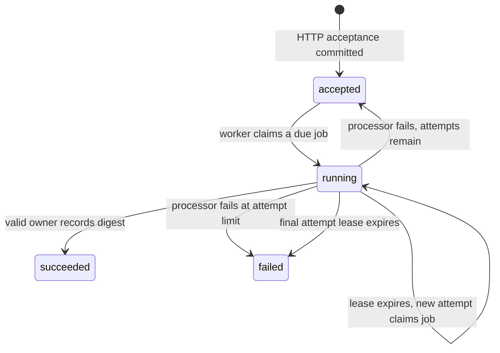

# Learn the worker milestone

The HTTP server accepts work. A separate Java worker claims it from PostgreSQL, computes the SHA-256 digest of its UTF-8 text, and records the result. It never interprets the text as a shell command, sends an email, or generates the report described in a payload.

## Run the experiment

Follow the README to start PostgreSQL and export `DATABASE_*`. Stop any older API or worker process before upgrading, then run `./migrate.sh` and restart the API with `./run.sh 8080`.

In another terminal:

```sh
curl -i http://127.0.0.1:8080/jobs \
  -H 'Content-Type: text/plain' \
  -H 'Idempotency-Key: worker-lesson-1' \
  --data 'hello'
```

Copy the returned job ID. Its state starts as `accepted` (queued), with zero attempts. In a terminal with the same database environment:

```sh
./worker.sh --once
```

This processes one eligible job, which may be an older queued job if your database already has work. For continuous processing, use `./worker.sh`; stop it with Ctrl+C.

```sh
curl http://127.0.0.1:8080/jobs/REPLACE_WITH_JOB_ID
```

Once this job is processed, the status is `succeeded`, attempts is 1, and `result_sha256` is:

```text
2cf24dba5fb0a30e26e83b2ac5b9e29e1b161e5c1fa7425e73043362938b9824
```

Repeat the POST with the same key and text: the same job ID and current execution state return with HTTP 200. A client retry does not enqueue a completed job again or reset its attempt budget.

## The state machine



## What is a lease?

A lease grants one attempt ownership for 30 seconds. PostgreSQL records a random token and expiry time. The worker commits the claim transaction, then executes outside the database lock.

Another worker skips locked rows and can work on another job. It cannot claim this job while its lease is active. If the original worker disappears, the expired lease lets a later polling worker reclaim the job.

Completion and failure updates require the **same token**, `running` state, and an unexpired lease. An old worker's late response cannot overwrite a new attempt. This is sometimes called fencing a stale worker.

## Retries and failure

Every claim consumes an attempt, including one abandoned by a crashed process. The default maximum is three. A processor exception requeues the job after 1 second, then 2 seconds; configured larger budgets use exponential delay capped at 30 seconds. Only the fixed code `execution_failed` is stored, not the exception message.

A crashed worker does not report failure. Recovery waits for the lease to expire. If the final attempt expires, the next polling worker marks the job `failed` with `lease_expired`. Recovery therefore requires a running worker; time passing alone does not update a row.

The built-in hash task is deterministic and has no external side effects. Retry failures are tested with an injected failing processor; there is no public endpoint that intentionally fails jobs.

## Why this is not exactly-once execution

A worker might compute the digest and crash before recording success. The next attempt computes it again. A token protects the database result, but cannot undo an external side effect. Replacing hashing with email or payment processing would require a separate idempotent side-effect design.

## Code reading order

1. `JobWorker.runOnce`: claim → process → record success/failure.
2. `WorkerStore.claim`: select one due/expired job with `FOR UPDATE SKIP LOCKED`, issue a lease, increment attempts, commit.
3. `WorkerStore.finish`: conditional update rejects stale or expired ownership.
4. Migration `002_worker_lifecycle.sql`: durable execution fields and consistency constraints.
5. `WorkerIntegrationTest`: competing workers, forced lease expiry, stale tokens, retry exhaustion, and a child process that exits abruptly after claiming.

There is no heartbeat or execution timeout for arbitrary processors. The shipped processor handles at most 8 KiB of text and finishes quickly. Do not plug in unbounded tasks and assume the lease stops their execution.
